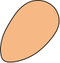
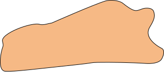
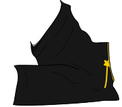

# me-generator-images
Contains all parts for [me-generator](https://github.com/vladdeSV/me-generator).

<table>
  <tr>
    <td></td>
    <td></td>
    <td></td>
    <td></td>
    <td></td>
  </tr>
  <tr>
    <td></td>
    <td></td>
    <td></td>
    <td></td>
    <td></td>
  </td>
  <tr>
    <td colspan="2"></td>
    <td colspan="2"></td>
    <td></td>
  </td>
  <tr>
    <td></td>
    <td></td>
    <td></td>
    <td colspan="2"></td>
  </tr>
  <tr>
    <td colspan="2"></td>
    <td colspan="2"></td>
    <td></td>

  </tr>
  <tr>
    <td colspan="2"></td>
    <td></td>
    <td></td>
  </tr>
</table>

## License
CC-BY-SA-4.0 © [Vladimirs Nordholm](https://github.com/vladdeSV) 
